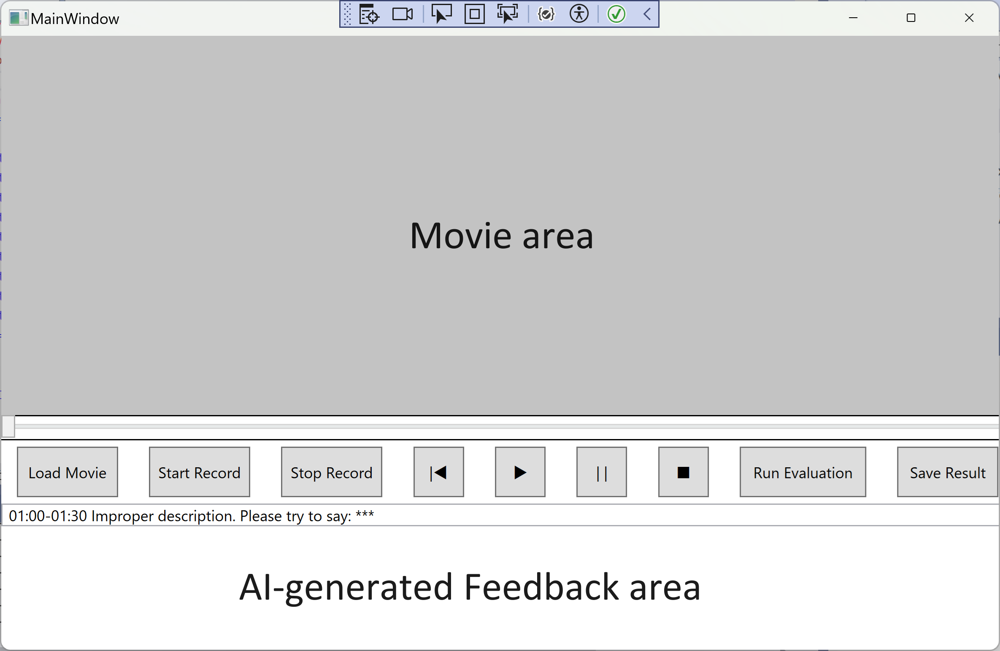

# Academic Presentation Rehearsal Agent
This is the git repository for the Academic Presentation Rehearsal Agent.

## Purpose 
The app will allow users to:
1. Upload their presentation materials (Paper PDFs / Slides).
2. Record presentations using Zoom-like features with webcam and microphone input.

## Function Descriptions
### Evaluation Module
1. **Overall Feedback on Logical Flow Based on Presentation Materials:**
   - **Example:**
     - **Bad Description Order:**
       - **Issue:** The slides show Fig. 1 and Fig. 2, but the presenter describes Fig. 2 first and then Fig. 1.
       - **Expected Feedback:** `<Start_time_stamp> <Stop_time_Stamp>: You described the figures in an improper order. Please consider correcting this.`
     - **Lack of Relation:**
       - **Issue:** Pages 2 and 3 cover completely different topics, yet there is no transition between them.
       - **Expected Feedback:** `<Start_time_stamp> <Stop_time_Stamp>: There is a lack of connection between topics. Please consider adding a bridging explanation.`

2. **Narration Intelligibility Checking (NLP-based):**
   - Transcribe the presenter's utterances and identify poorly described parts (grammar errors, non-professional terms, etc.).
   - **Expected Feedback:** `<Start_time_stamp> <Stop_time_Stamp>: Improper description. Please try to say: ***`

3. **Accentedness Checking:**
   - Focus on the quality of local pronunciation and point out poorly pronounced words. If possible, provide the proper pronunciation.
   - **Expected Feedback:** `<Start_time_stamp> <Stop_time_Stamp>: Unintelligibile Pronouciation. Please try to say: ***`
### UI Module
1. As the video/audio will be a temporal sequence, label the timestamps of the parts that need fixing.
2. Make it interactive: by clicking the timestamp link, the playback should jump to the related timestamp.
3. Provide feedback as a PDF report or a video with annotations.

